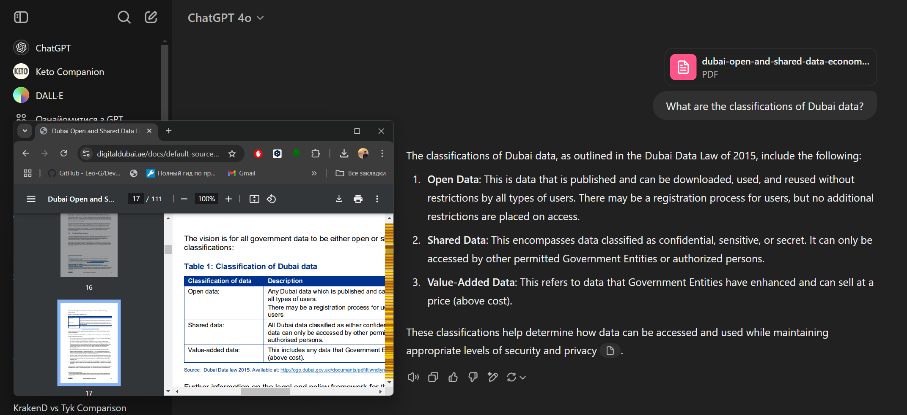
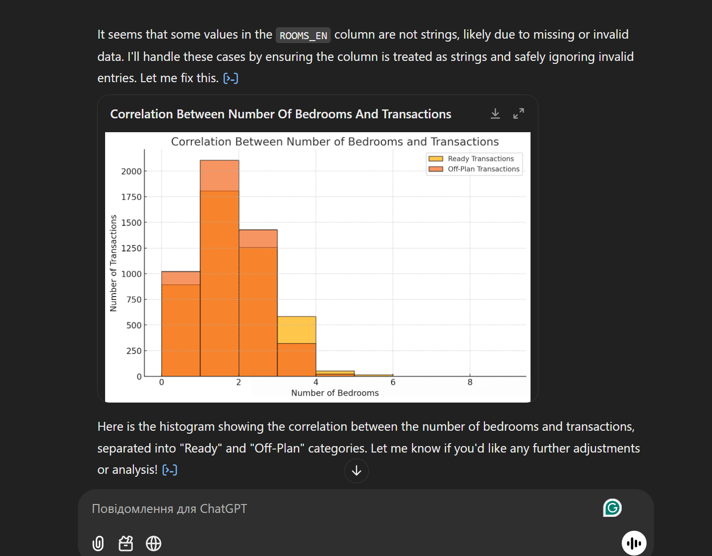
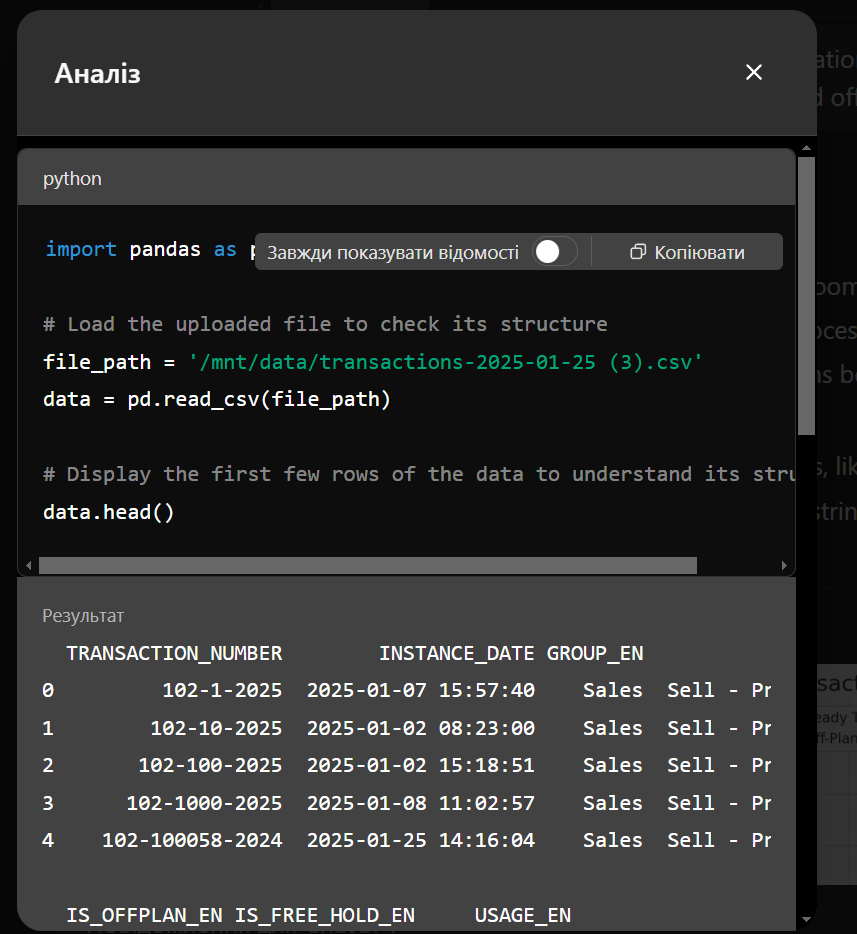
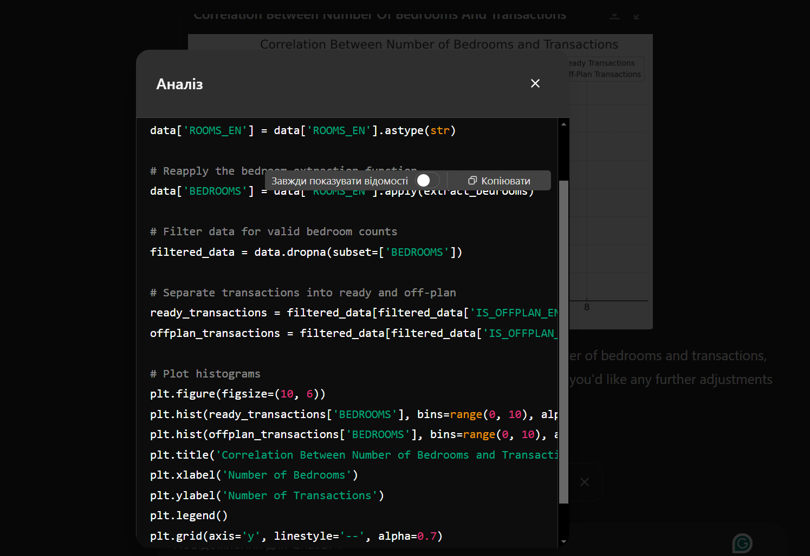

#  Chat with data over pdf document
**Datasource:** [Dubai Open and Shared Data Economic and Social Impact Study](https://www.digitaldubai.ae/docs/default-source/publications/dubai-open-and-shared-data-economic-and-social-impact-study.pdf)
**Prompt:** 
```What are the classifications of Dubai data?```
**Result**

---
#  Code interpreter to build histogram with matplotlib
**Datasource:** [Dubai Land Department - Real Estate Data](https://dubailand.gov.ae/en/open-data/real-estate-data/#/)
**Prompt:** 
```create a histogram to show the correlation between the number of bedrooms and transactions, ready and offplan transactions matplotlib```
**Result**

 
