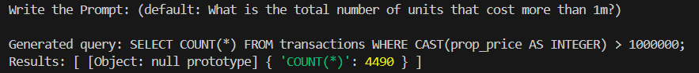

# README

This repository contains a simple Node.js script that does the following:

1. Checks if an OpenAI API key is set in your environment (`OPENAI_API_KEY`).
2. If none is found, prompts you to provide one interactively (with the option to exit).
3. Asks you for a prompt for sql query generation.
5. Executes the query in transactions database.

---

## Prerequisites

- **Node.js** (v20 or higher is recommended)
- **npm** (comes bundled with Node.js)
- An **OpenAI API key** (sign up at [OpenAI](https://platform.openai.com/) if you don’t have one)

---

## Getting Started

1. **Clone** or **download** this repository.

2. Navigate into the repository folder:
   ```bash
   cd your-repo-folder
    ```
3. Navigate into the repository folder:
   ```bash
   npm install
    ```
4. Navigate into the repository folder:
   ```bash
   node call-function.js
    ```
   OR
    ```
   node call-function.js {TOKEN} "{prompt}"
    ```
## Example
