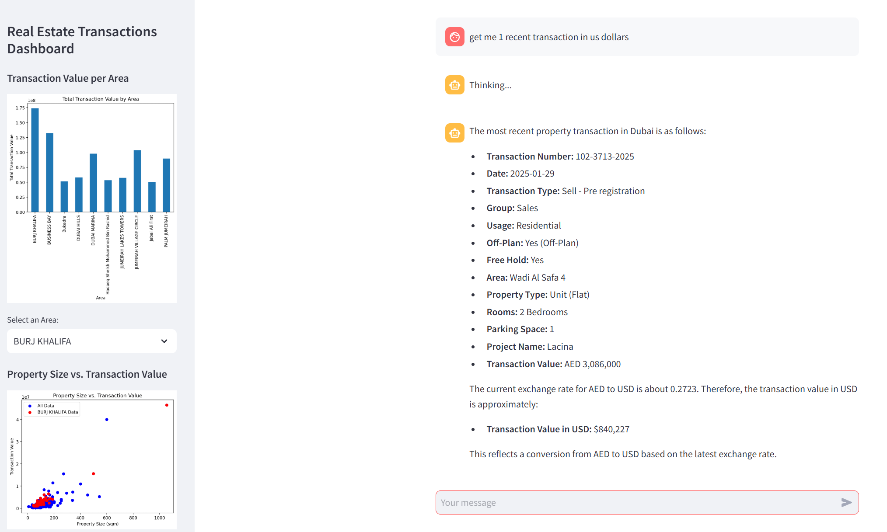

# README
## 🤖 Dubai properties transactions AI Assistant

## Overview
This project is a **Streamlit-based AI-powered assistant** designed to retrieve and analyze **Dubai real estate transactions** using public data from the **Dubai Land Department**. The application also fetches **currency exchange rates for AED** and provides insights into property transactions via an interactive dashboard.

## Features
- **Fetch Dubai Property Transactions** from an official API
- **Retrieve Exchange Rates** for AED to other currencies
- **Interactive Dashboard** for real estate analysis
- **AI Chatbot** for querying transactions using OpenAI API
- **Graphical Data Representation** using Matplotlib
- **Retry Mechanism** for handling HTTP request failures
- **Secure API Key Management** using `.env` file


---

## Prerequisites

- **Python** (v3.12)
- An **OpenAI API key** (sign up at [OpenAI](https://platform.openai.com/) if you don’t have one)

---

## Getting Started 

1. **Clone** or **download** this repository.

2. Navigate into the repository folder:
   ```bash
   cd your-repo-folder
3. Install Dependencies:
   ```bash
   pip install -r requirements.txt
4. Create a .env file in the project root and add the following keys (optional):
   ```bash
   OPENAI_API_KEY=your_openai_api_key

5. Running the Application:
   ```bash
   streamlit run agent.py

## Functionality
### Fetching Property Transactions
- The app allows users to fetch transactions **based on date range and property type**.
- Data is retrieved from **Dubai Land Department** API.
- Transactions are displayed in a structured **data table**.

### Currency Exchange Rate
- Retrieves the latest **AED exchange rates** from an API.

### AI Chatbot
- Users can query the system for property transactions using **natural language**.
- Uses **OpenAI API** for intelligent responses.

### Interactive Dashboard
- **Transaction Value per Area**: Bar chart summarizing transactions per area.
- **Property Size vs. Transaction Value**: Scatter plot to analyze property sizes and transaction values.

## Security Measures
- API calls have **retry strategies** to handle failures.
- **Transaction limit** is enforced to prevent excessive API calls.

## Future Enhancements
- Add more advanced **AI-powered insights** on real estate trends.
- Support for **mult