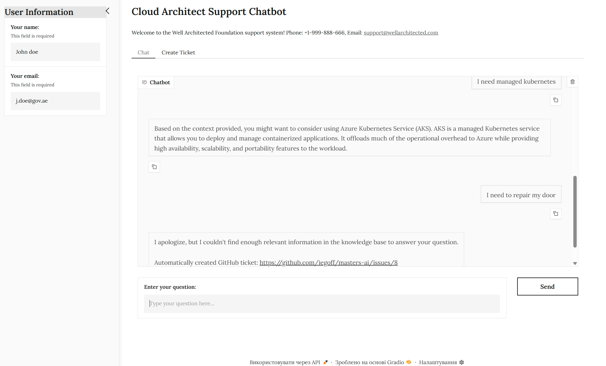

# README
## 🤖 Cloud Architect Support Chatbot


## Overview
This project is a **Gradio-based AI-powered support chatbot** designed to assist users with **Cloud Architecture and Well-Architected Framework (WAF)** questions. The application provides intelligent responses based on a knowledge base and automatically creates GitHub tickets when needed.
 [🚀Demo is here](https://huggingface.co/spaces/iegoff/masters-ai-chatbot)
## Features
- **AI-Powered Chat Interface** using OpenAI's GPT-4
- **Knowledge Base Integration** using FAISS vector store
- **Automatic Ticket Creation** for unanswered questions
- **User Profile Management** with required fields
- **Real-time Similarity Matching** for relevant responses
- **Secure API Key Management** using `.env` file
- **GitHub Integration** for ticket management

---

## Prerequisites

- **Python** (v3.8 or higher)
- An **OpenAI API key** (sign up at [OpenAI](https://platform.openai.com/) if you don't have one)
- A **GitHub Personal Access Token** (for ticket creation)

---

## Getting Started 

1. **Clone** or **download** this repository.

2. Navigate into the repository folder:
   ```bash
   cd your-repo-folder
   ```

3. Install Dependencies:
   ```bash
   pip install -r requirements.txt
   ```

4. Create a `.env` file in the project root and add the following keys:
   ```bash
   OPENAI_API_KEY=your_openai_api_key
   GITHUB_REPO_OWNER=your_github_username
   GITHUB_REPO_NAME=your_repo_name
   GITHUB_PAT_TOKEN=your_github_pat_token
   ```

5. Running the Application:
   ```bash
   python app.py
   ```

## Functionality
### Chat Interface
- Users can ask questions about **Cloud Architecture and WAF**
- The system provides **intelligent responses** based on the knowledge base
- **Real-time similarity matching** ensures relevant answers
- **User profile required** for personalized support

### Knowledge Base
- Uses **FAISS vector store** for efficient similarity search
- **OpenAI embeddings** for semantic understanding
- **Configurable similarity threshold** for response quality

### Ticket System
- **Automatic ticket creation** when no relevant matches found
- **GitHub integration** for issue tracking
- **User information included** in tickets
- **Professional ticket formatting**

### User Management
- **Required profile information** (name and email)
- **Real-time validation** of user inputs
- **Clear status indicators** for required fields
- **Secure information handling**

## Security Measures
- **Environment variables** for sensitive information
- **Input validation** for user data
- **Secure API key management**
- **GitHub token protection**

## Future Enhancements
- Add support for **multiple knowledge bases**
- Implement **user authentication**
- Add **ticket status tracking**
- Support for **file attachments** in tickets
- Enhanced **analytics and reporting**

## Support
For support, please contact:
- Phone: +1-999-888-666
- Email: support@wellarchitected.com 