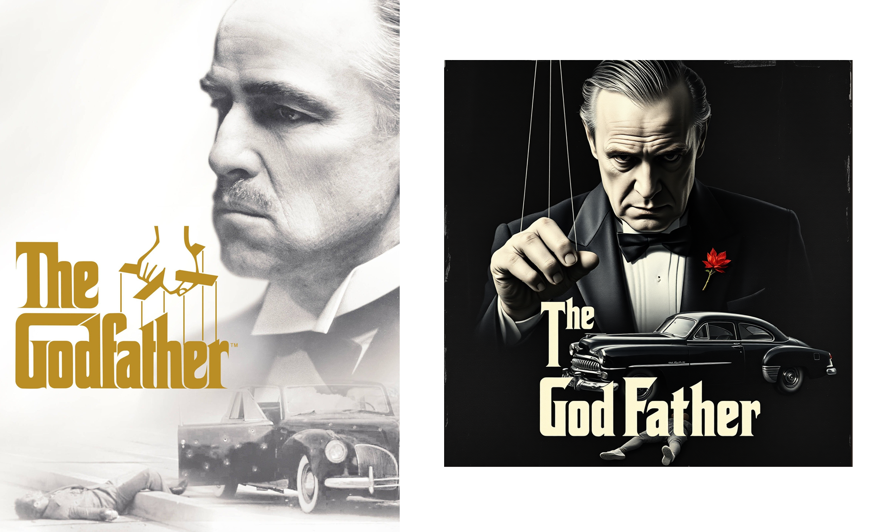
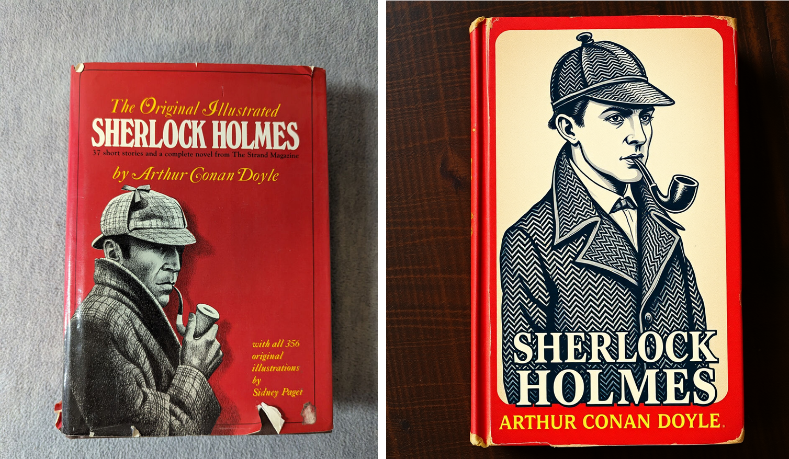
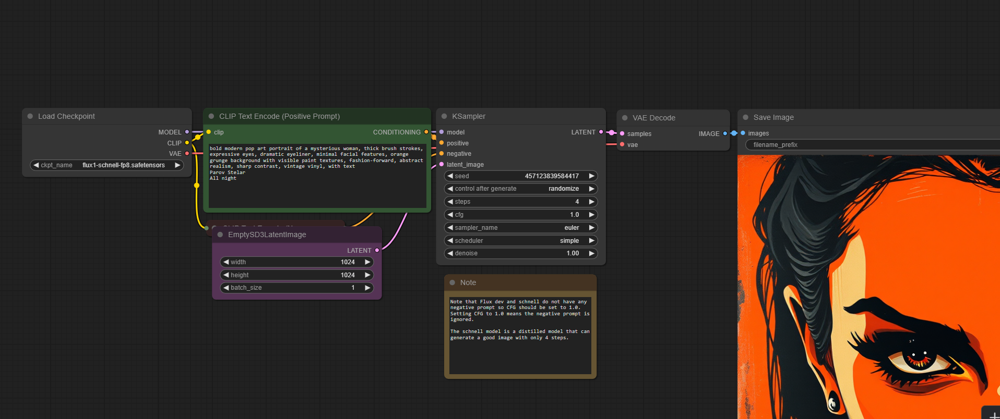

# Alternative Cover Project***

---

## 1. Results






---

## 2. Technical generation details  


<details>
<summary>Generation metadata</summary>

| Field | Value |
|-------|-------|
| **Model** | Flux1 Schnell FP8 |
| **Model Link** | <https://huggingface.co/Comfy-Org/flux1-schnell/blob/main/flux1-schnell-fp8.safetensors> |
| **Sampler** | `Euler` |
| **Steps** | `5` |
| **CFG Scale** | `1.0` |
| **Seed** | `randomized` |
| **Resolution** | `1024 × 1024` |
| **Batch size** | `4` |
| **Prompt** | 
```
vintage red book cover, black and white ink illustration of a detective in tweed coat and deerstalker hat, smoking a curved pipe, serious expression, classic 19th-century style, dramatic lighting, bold serif typography, yellow and white text layout, traditional literary style, textured background, slight book wear and tear for realism
sherlock holmes by arthur conan doyle
```
```
dramatic grayscale poster, close-up of a serious older man with slicked-back hair and tuxedo, puppet master hand, above vintage text The Godfather, mafia crime theme, 1940s black car with bullet holes, lifeless body on pavement, soft light, cinematic depth, movie poster style, high contrast, classic mafia atmosphere, VHS, textured background
```
```
vintage red book cover, black and white ink illustration of a detective in tweed coat and deerstalker hat, smoking a curved pipe, serious expression, classic 19th-century style, dramatic lighting, bold serif typography, yellow and white text layout, traditional literary style, textured background, slight book wear and tear for realism
sherlock holmes by arthur conan doyle
``` 

</details>

---

---

## 3. Workflow & Infrastructure

| Component | Details |
|-----------|---------|
| **Generation UI** | **ComfyUI v0.4** (<https://github.com/comfyanonymous/ComfyUI>) |
| **Execution environment** | Hetzner dedicated GPU server |
| **GPU** | NVIDIA RTX A6000 (22 GB VRAM) |
| **VRAM usage** | ~9 GB (peak) |
| **Python version** | 3.12 |
| **OS** | Ubuntu 24.0 LTS |


